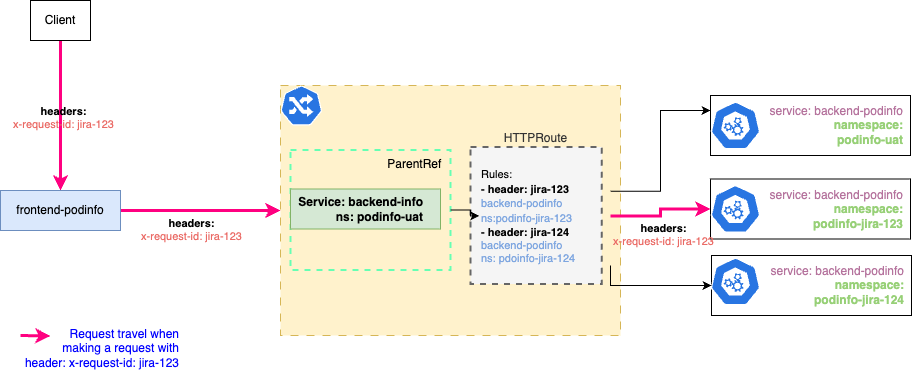

# Microservice Project: Dynamic Microservice Injection for Streamlined Testing

This repository contains demonstration code for the blog post [Dynamic Microservice Injection for Streamlined Testing](https://medium.com/@quydoantran/httprouter-hacks-dynamic-microservice-injection-for-streamlined-testing-42550bff8add).


## Required Tools and Libraries

- Docker
- Helm: A package manager for Kubernetes, used for deploying our charts.
- Linkerd: A service mesh for Kubernetes, providing network functions like routing and load balancing.
- Go: Used for controlling the flow of the deployment process.

## Setup

- Enable Kubernetes on Docker Desktop. Follow the instructions [here](https://docs.docker.com/desktop/kubernetes/).
- Install Helm. You can find the installation guide [here](https://helm.sh/docs/intro/install/).
- Install Linkerd. The installation guide is available [here](https://linkerd.io/2/getting-started/).
- Install Go. The installation guide can be found [here](https://golang.org/doc/install).
- [Optional] Build the Go project using the provided script: `./deploy-service/build/build-cmd.sh`.

## Deploy Microservices


1. Deploy `backend-podinfo` to the `podinfo-uat` namespace:

    ```bash
    # Deploy to the uat namespace
    go run cmd/deploy/*.go -chart podinfo/podinfo -name backend -service podinfo -uat ./assets/http-router.yml
    ```

2. Deploy `backend-podinfo` to the `podinfo-jira-123` namespace for testing JIRA ticket **jira-123**:

    ```bash
    # Deploy to the podinfo-jira-123 namespace
    go run cmd/deploy/*.go -jira jira-123 -chart podinfo/podinfo -name backend -service podinfo ./assets/http-router.yml
    ```

3. Deploy the `frontend` service, which will make requests to `backend-podinfo`:

    ```bash
    kubectl create ns frontend-uat --dry-run=client -o yaml | linkerd inject -  | kubectl apply -f -
    helm upgrade --install frontend -n frontend-uat --set backend=http://backend-podinfo.podinfo-uat.svc.cluster.local:9898/env podinfo/podinfo
    ```

4. Forward connections from a local port to a port on a pod:

    ```bash
    kubectl -n frontend-uat port-forward svc/frontend-podinfo 9898 &
    ```

5. Test the deployment:

    ```bash
    curl -sX GET -H "x-request-id: jira-124" localhost:9898/echo | grep PODINFO_UI_MESSAGE
    curl -sX GET -H "x-request-id: jira-123" localhost:9898/echo | grep PODINFO_UI_MESSAGE
    curl -sX GET -H "x-request-id: jira-random" localhost:9898/echo | grep PODINFO_UI_MESSAGE
    ```

6. Deploy `backend-podinfo` to the `podinfo-jira-124` namespace for testing JIRA ticket **jira-124**:

    ```bash
    # Deploy to the podinfo-jira-124 namespace
    go run cmd/deploy/*.go -jira jira-124 -chart podinfo/podinfo -name backend -service podinfo ./assets/http-router.yml
    ```

7. Test the deployment again:

    ```bash
    curl -sX GET -H "x-request-id: jira-124" localhost:9898/echo | grep PODINFO_UI_MESSAGE
    curl -sX GET -H "x-request-id: jira-123" localhost:9898/echo | grep PODINFO_UI_MESSAGE
    curl -sX GET -H "x-request-id: jira-random" localhost:9898/echo | grep PODINFO_UI_MESSAGE
    ```

8. After finishing testing for jira-123, clean up the resources:

    ```bash
    go run cmd/destroy/*.go -jira jira-123
    ```
